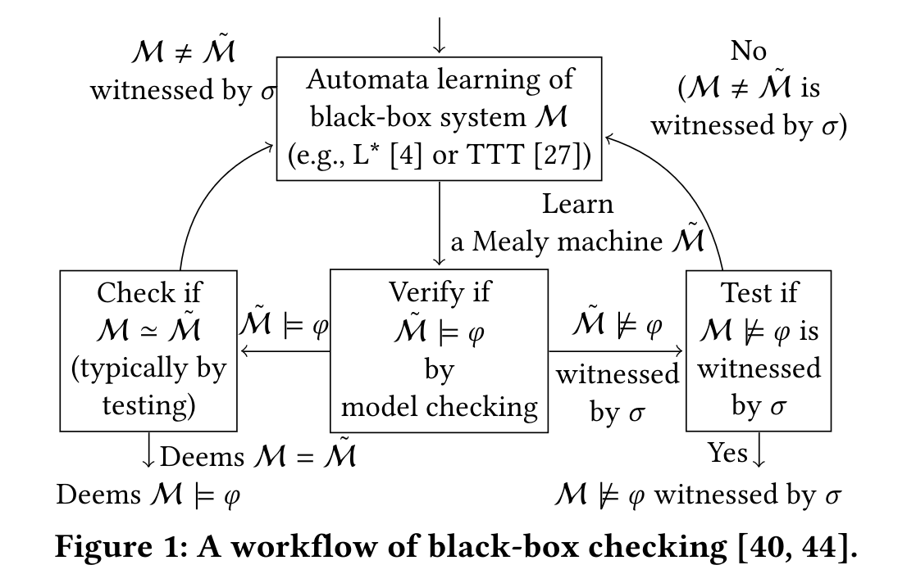
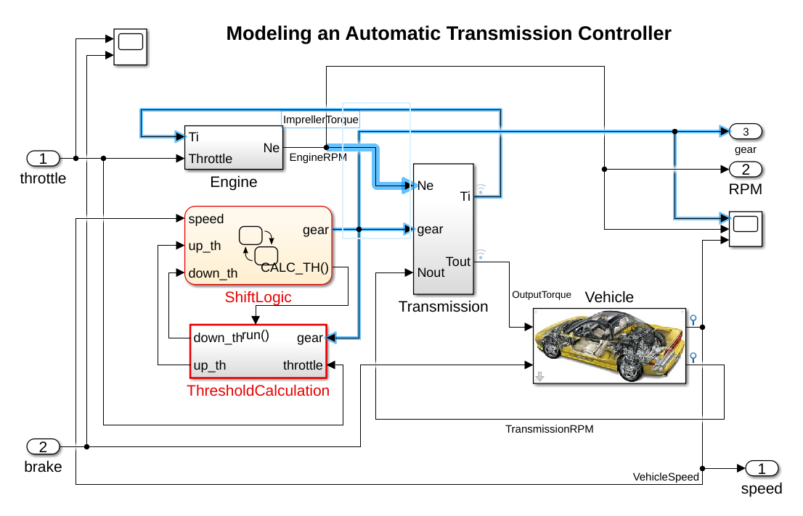
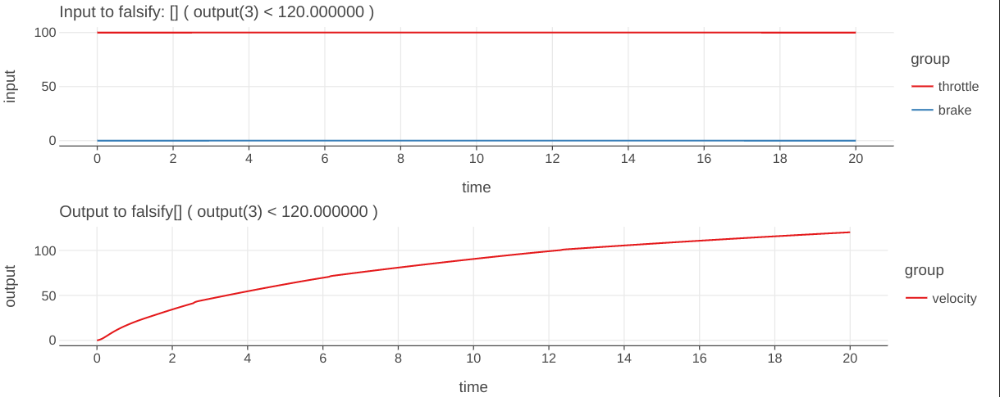
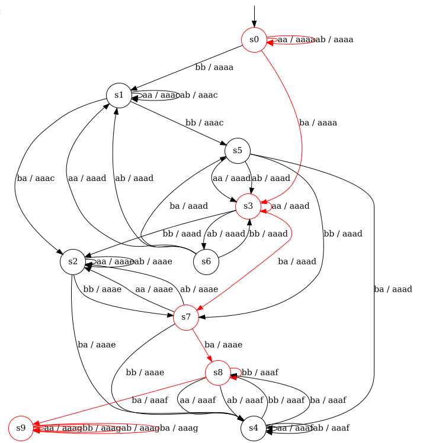

# Tutorial
## Introduction
FalCAuN is a toolkit for testing black-box systems like CPSs (cyber-physical systems) based on automata learning and model checking.
Given a list of specifications as STL(Signal Temporal Logic) formulas,
FalCAuN tests whether the given system satisfies the specifications by finding an input signal that causes the corresponding output signal to violate the specifications.
This process is called falsification.

The main feature of FalCAuN is the combination of black-box checking and optimization-based falsification.
BBC (black-box checking) [Meinke18], [Peled+99] is a testing method that constructs a Mealy machine via automata learning from a black-box system, then uses this machine for model checking the specifications.
The main benefit of black-box checking is that the system model is unnecessary, and the system can be black-box.
In contrast, the standard model checking requires the system model, which is usually challenging.


Optimization-based falsification [Kapinski+16] is a testing method to find a counterexample violating a specification by minimizing the satisfaction degree of the specification. The minimization is done by black-box optimization, such as a genetic algorithm and simulated annealing. FalCAuN uses the robust semantics of STL as the degree.

<!--  -->

## Tutorial: Automatic Transmission benchmark
Here, we demonstrate the usage of FalCauN with an example called automatic transmission benchmark [Hoxha+14] as a tutorial.
We provide the same code in `example/kotlin/ATS1-step-5.ipynb`, which can be run using Jupyter with Kotlin kernel.
Details are in `example/kotlin/README.md`.
This example uses a Simulink model of an automatic transmission system. It is located in `example/kotlin/Autotrans_shift.mdl`.


First, include FalCAuN and write `initScript` Matlab executes.
```kotlin
import net.maswag.falcaun.*

// Initializing script for MATLAB
val initScript = """
versionString = version('-release');
oldpath = path;
path(strcat(userpath, '/Examples/R', versionString, '/simulink_automotive/ModelingAnAutomaticTransmissionControllerExample/'), oldpath);

mdl = 'Autotrans_shift';
load_system(mdl);
"""
val paramNames = listOf("throttle", "brake")
val signalStep = 5.0
val simulinkSimulationStep = 0.0025

// Load the automatic transmission model. This must be manually closed!!
val sul = SimulinkSUL(initScript, paramNames, signalStep, simulinkSimulationStep)
```
`SimulinkSUL` implements the `Closable` interface of Java, and it is recommended to use the `use` function of Kotlin, though this example does not use it.

Second, define a mapper.
Since Mealy machines receive finite events, real-valued signals are abstracted into a finite alphabet.
`NumericSULMapper` provides input, output, and (general) signal mappers:

- The input mapper maps discrete input events into a real-valued input signal.
- The output mapper maps a real-valued output signal into discrete observations.
- The signal mapper creates "pseudo output signals" from the input and output signals to handle complicated properties.

The approximated Mealy machine uses these alphabet-abstracted signals. For instance, in the following example, an input signal consists of two dimensions (throttle and brake), and we create input events for each pair of the following values: (0.0, 0.0), (100.0, 0.0), (0.0, 325.0), and (100.0, 325.0). An output signal consists of three dimensions (velocity, acceleration, and gear value). By specifying `previous_max_output(0)` in the definition of signal mapper, it creates a pseudo signal of the maximum value of `output(0)` (velocity in this case) since the latest sampling point. The output mapper ignores the velocity, acceleration, and gear value and assigns a discrete observation for each of the following range of the pseudo signal: $(-\infty, 20.0)$, $[20.0, 40.0)$, $[40.0, 60.0)$, $[60.0, 80.0)$, $[80.0, 100.0)$, $[100.0, 120.0)$, and $[120.0, \infty)$.


```kotlin
// Define the input and output mappers
val throttleValues = listOf(0.0, 100.0)
val brakeValues = listOf(0.0, 325.0)
val inputMapper = InputMapperReader.make(listOf(throttleValues, brakeValues))
val ignoreValues = listOf(null)
val velocityValues = listOf(20.0, 40.0, 60.0, 80.0, 100.0, 120.0, null)
val accelerationValues = listOf(null)
val gearValues = listOf(null)
val outputMapperReader = OutputMapperReader(listOf(ignoreValues, accelerationValues, gearValues, velocityValues))
outputMapperReader.parse()
val mapperString = listOf("previous_max_output(0)").joinToString("\n")
val signalMapper: ExtendedSignalMapper = ExtendedSignalMapper.parse(BufferedReader(StringReader(mapperString)))
assert(signalMapper.size() == 1)
val mapper =
    NumericSULMapper(inputMapper, outputMapperReader.largest, outputMapperReader.outputMapper, signalMapper)
```

Third, give STL formulas.
The syntax of STL in FalCAuN is as follows.

```
expr : atomic
     | expr && expr
     | expr || expr
     | expr -> expr
     | ! expr
     | GLOBALLY expr
     | GLOBALLY _ INTERVAL expr
     | EVENTUALLY expr
     | EVENTUALLY _ INTERVAL expr
     | X expr
     | expr U expr
     | expr U _ INTERVAL expr
     | ( expr )

atomic : signal(NATURAL) == value
       | signal(NATURAL) < value
       | signal(NATURAL) > value
       | signal(NATURAL) != value
       | input(NATURAL) == value
       | input(NATURAL) < value
       | input(NATURAL) > value
       | input(NATURAL) != value
       | output(NATURAL) == value
       | output(NATURAL) < value
       | output(NATURAL) > value
       | output(NATURAL) != value

value : -? NATURAL | -? FLOAT

GLOBALLY : '[]' | 'alw' | 'G'

EVENTUALLY : '<>' | 'ev' | 'F'

INTERVAL : [ NATURAL , NATURAL ]
```

`GLOBALLY` and `EVENTUALLY` have three alternative notations with the same semantics.
For STL semantics, see the paper [Waga20].

In FalCAuN, STL formulas are given as strings.
```kotlin
import net.maswag.falcaun.TemporalLogic.STLCost;

// Define the STL properties
val stlFactory = STLFactory()
val stlList: List<STLCost> = listOf(
    "[] (signal(3) < 120)",
).map { stlString ->
    stlFactory.parse(
        stlString,
        inputMapper,
        outputMapperReader.outputMapper,
        outputMapperReader.largest
    )
}.toList()
val signalLength = 6
val properties = AdaptiveSTLList(stlList, signalLength)
```
`STLFactory` is used to parse them.
`signal(3)` points to the fourth output signal, the pseudo signal in this case.

<!-- `AdaptiveSTLList` has the feature to find a violating signal efficiently. [Shijubo+, RV'21] -->

Then, define a verifier using the above.
A verifier needs `MealyEquivalenceOracle` to check if the given system and the learned Mealy machine behave equivalently.
In this example, the verifier below has two equivalence oracles: `CornerCaseEQOracle` and `GAEQOracle`:
`CornerCaseEQOracle` is an equivalence oracle that tests the equivalence for the corner case inputs, such as keeping the maximum throttle;
`GAEQOracle` is an equivalence oracle based on a genetic algorithm.
`addGAEQOracleAll` adds this oracle for each STL property.
```kotlin
val verifier = NumericSULVerifier(sul, signalStep, properties, mapper)

// Timeout must be set before adding equivalence testing methods
verifier.setTimeout(5 * 60) // 5 minutes

// First, try the corner cases
verifier.addCornerCaseEQOracle(signalLength, signalLength / 2);

// Constants for the GA-based equivalence testing
val maxTest = 50000
val populationSize = 200
val crossoverProb = 0.5
val mutationProb = 0.01

verifier.addGAEQOracleAll(
    signalLength,
    maxTest,
    ArgParser.GASelectionKind.Tournament,
    populationSize,
    crossoverProb,
    mutationProb
)

val result = verifier.run()
```

You can show the result via `verifier`.
```kotlin
// Print the result
if (result) {
    println("The property is likely satisfied")
} else {
    for (i in 0 until verifier.cexProperty.size) {
        println("${verifier.cexProperty[i]} is falsified by the following counterexample")
        println("cex concrete input: ${verifier.cexConcreteInput[i]}")
        println("cex abstract input: ${verifier.cexAbstractInput[i]}")
        println("cex output: ${verifier.cexOutput[i]}")
    }
}
println("Execution time for simulation: ${verifier.simulationTimeSecond} [sec]")
println("Number of simulations: ${verifier.simulinkCount}")
println("Number of simulations for equivalence testing: ${verifier.simulinkCountForEqTest}")
```

In this example, since the system does not satisfy the specification,
a counterexample violating the specification is shown as follows.
`concrete input` is a list of real values specifying the signal given to the system.
`abstract input` is the alphabet-abstracted input by the input mapper.
```
[] ( output(3) < 120.000000 ) is falsified by the following counterexample
cex concrete input: [0.0 100.0 0.0; 5.0 100.0 0.0; 10.0 100.0 0.0; 15.0 100.0 0.0; 20.0 100.0 0.0]
cex abstract input: ba ba ba ba ba
cex abstract output: aaaa aaad aaae aaaf aaag
```

The following input and output to the target system shows this output above.


Intuitively the formula `[] ( output(3) < 120.000000 )` means that
the velocity does not exceed `120`, and
FalCAuN falsified this specification by finding a counterexample.
This counterexample shows when `throttle` input keeps the max value `100`, full throttle, the velocity exceeds `120` in `20` ticks.

The Mealy machine constructed by an automata learning algorithm is shown below.
This graph highlighting the violating path is described by the above `abstract input` and `abstract output`.



Finally, don't forget to terminate the Matlab engine.
```kotlin
sul.close()
```

References
----------

<!-- - [Shijubo+, RV'21] Efficient Black-Box Checking via Model Checking with Strengthened Specifications. Junya Shijubo, Masaki Waga, and Kohei Suenaga -->
- [Waga20]: Waga, Masaki. "Falsification of cyber-physical systems with robustness-guided black-box checking." Proceedings of the 23rd International Conference on Hybrid Systems: Computation and Control. 2020.
- [Meinke18]: Meinke, Karl. "Learning-based testing: recent progress and future prospects." Machine Learning for Dynamic Software Analysis: Potentials and Limits: International Dagstuhl Seminar 16172, Dagstuhl Castle, Germany, April 24-27, 2016, Revised Papers. Springer International Publishing, 2018.
- [Peled+99]: Peled, Doron, Moshe Y. Vardi, and Mihalis Yannakakis. "Black box checking." International Conference on Protocol Specification, Testing and Verification. Boston, MA: Springer US, 1999.
- [Kapinski+16]: Kapinski, James, et al. "Simulation-based approaches for verification of embedded control systems: An overview of traditional and advanced modeling, testing, and verification techniques." IEEE Control Systems Magazine 36.6 (2016): 45-64.
- [Hoxha+14]: Hoxha, Bardh, Houssam Abbas, and Georgios Fainekos. "Benchmarks for Temporal Logic Requirements for Automotive Systems." ARCH@ CPSWeek 34 (2014): 25-30.
