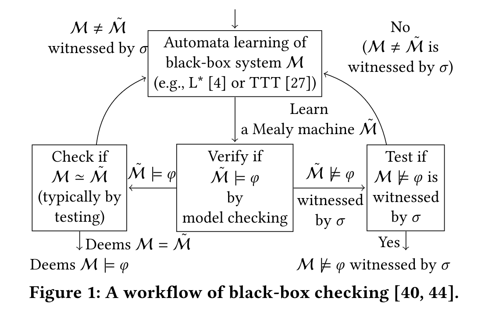

# Tutorial
## Introduction
FalCAuN is a toolkit for testing black-box systems like CPSs (cyber-physical systems) based on automata learning and model checking.
Given specifications as STL(Signal Temporal Logic) formulas,
FalCAuN checks the given system satisfies the specifications by finding an input signal that its corresponding output signal violates the specifications.
It is called falsification.

The main feature of FalCAuN is the combination of BBC and optimization-based falsification.
BBC (Black-box checking) [Meinke, MLDSA'18], [Peled et al., JALC'02] is a way of testing method that constructs a mealy machine by automata-learning from a black-box system and
uses this mealy machine for model-checking of the specifications.
Since in general a system like CPS is large and complicated,
it is hard to do model-checking to the system directly.
In contrast, model-checking to the mealy-machine is easier and more light-weighted.
<!--  -->
Optimization-based falsification is a testing method to find a counter-example
violating a specification by minimizing a kind of quantitative degree through simulations. FalCAuN uses robust semantics of STL formulas as the degree.

## Tutorial: Automatic Transmission benchmark
It shows an example called automatic transmission benchmark [Hoxha et al., ARCH@CPSWeek 2014] as a tutorial.
We provide the same code in `example/kotlin/ATS1-step-5.ipynb` and you can run it using jupyter with kotlin kernel.
Details are in `example/kotlin/README.md`.
This example uses a system simulating an automobile transmission system and implemented by Simulink.
It is located in `example/kotlin/Autotrans_shift.mdl`.


First, include falcaun and write `initScript` Matlab executes.
```kotlin
import net.maswag.falcaun.*

// Initializing script for matlab
val initScript = """
versionString = version('-release');
oldpath = path;
path(strcat(userpath, '/Examples/R', versionString, '/simulink_automotive/ModelingAnAutomaticTransmissionControllerExample/'), oldpath);

mdl = 'Autotrans_shift';
load_system(mdl);
"""
val paramNames = listOf("throttle", "brake")
val signalStep = 5.0
val simulinkSimulationStep = 0.0025

// Load the automatic transmission model. This must be manually closed!!
val sul = SimulinkSUL(initScript, paramNames, signalStep, simulinkSimulationStep)
```
`SimulinkSUL` implements `Closable` so `use` function is recommended to use, though this code does not use it.

Second, define a mapper.
It is hard to deal with real-valued signals so that
alphabet abstraction is introduced.
A `SULMapper` provides an input mapper, mapping from real values to discrete alphabets, and an output mapper vise versa.
The approximated mealy-machine uses these alphabet-abstracted signals.
```kotlin
// Define the input and output mappers
val throttleValues = listOf(0.0, 100.0)
val brakeValues = listOf(0.0, 325.0)
val inputMapper = InputMapperReader.make(listOf(throttleValues, brakeValues))
val ignoreValues = listOf(null)
val velocityValues = listOf(20.0, 40.0, 60.0, 80.0, 100.0, 120.0, null)
val accelerationValues = listOf(null)
val gearValues = listOf(null)
val outputMapperReader = OutputMapperReader(listOf(ignoreValues, accelerationValues, gearValues, velocityValues))
outputMapperReader.parse()
val mapperString = listOf("previous_max_output(0)").joinToString("\n")
val signalMapper: ExtendedSignalMapper = ExtendedSignalMapper.parse(BufferedReader(StringReader(mapperString)))
assert(signalMapper.size() == 1)
val mapper =
    NumericSULMapper(inputMapper, outputMapperReader.largest, outputMapperReader.outputMapper, signalMapper)
```

Third, give STL formulas.
The syntax is below
```
expr : atomic
     | expr && expr
     | expr || expr
     | expr -> expr
     | ! expr
     | GLOBALLY expr
     | GLOBALLY _ INTERVAL expr
     | EVENTUALLY expr
     | EVENTUALLY _ INTERVAL expr
     | X expr
     | expr U expr
     | expr U _ INTERVAL expr
     | ( expr )

atomic : signal(NATURAL) == value
       | signal(NATURAL) < value
       | signal(NATURAL) > value
       | signal(NATURAL) != value
       | input(NATURAL) == value
       | input(NATURAL) < value
       | input(NATURAL) > value
       | input(NATURAL) != value
       | output(NATURAL) == value
       | output(NATURAL) < value
       | output(NATURAL) > value
       | output(NATURAL) != value

value : -? NATURAL | -? FLOAT

GLOBALLY : '[]' | 'alw' | 'G'

EVENTUALLY : '<>' | 'ev' | 'F'

INTERVAL : [ NATURAL , NATURAL ]
```
`GLOBALLY` and `EVENTUALLY` have 3 notations and the same meanings each.
For STL semantics, see the paper[Waga, HSCC'20].

STL formulas are given as strings.
```kotlin
import net.maswag.falcaun.TemporalLogic.STLCost;

// Define the STL properties
val stlFactory = STLFactory()
val stlList: List<STLCost> = listOf(
    "[] (signal(3) < 120)",
).map { stlString ->
    stlFactory.parse(
        stlString,
        inputMapper,
        outputMapperReader.outputMapper,
        outputMapperReader.largest
    )
}.toList()
val signalLength = 6
val properties = AdaptiveSTLList(stlList, signalLength)
```
`STLFactory` is used to parse them.
`signal(3)` points to the third element of the list given to the `OutputMapperReader` above, `velocityValues`.

<!-- `AdaptiveSTLList` has the feature to find a violating signal efficiently. [Shijubo+, RV'21] -->

Then, define a verifier using them above.
A verifier needs `MealyEquivalenceOracle`, used to check
if the given system and the mealy-machine by learning do the same behavior.
This is a part of BBC.
In this example, the verifier below has two equivalence oracles.
`GAEQOracle` is an equivalence oracle based on a genetic algorithm.
`addGAEQOracleAll` adds this oracle for each STL property.
```kotlin
val verifier = NumericSULVerifier(sul, signalStep, properties, mapper)

// Timeout must be set before adding equivalence testing
verifier.setTimeout(5 * 60) // 5 minutes

// First, try corner cases
verifier.addCornerCaseEQOracle(signalLength, signalLength / 2);

// Constants for the GA-based equivalence testing
val maxTest = 50000
val populationSize = 200
val crossoverProb = 0.5
val mutationProb = 0.01

verifier.addGAEQOracleAll(
    signalLength,
    maxTest,
    ArgParser.GASelectionKind.Tournament,
    populationSize,
    crossoverProb,
    mutationProb
)

val result = verifier.run()
```

You can show the result via `verifier`.
```kotlin
// Print the result
if (result) {
    println("The property is likely satisfied")
} else {
    for (i in 0 until verifier.cexProperty.size) {
        println("${verifier.cexProperty[i]} is falsified by the following counterexample")
        println("cex concrete input: ${verifier.cexConcreteInput[i]}")
        println("cex abstract input: ${verifier.cexAbstractInput[i]}")
        println("cex output: ${verifier.cexOutput[i]}")
    }
}
println("Execution time for simulation: ${verifier.simulationTimeSecond} [sec]")
println("Number of simulations: ${verifier.simulinkCount}")
println("Number of simulations for equivalence testing: ${verifier.simulinkCountForEqTest}")
```

For example, since the system does not satisfy the specification,
a counter-example violating the specification will be output like below.
`concrete input` is real values given to the system directly.
`abstract input` is the alphabet-abstracted input by the input mapper.
```
[] ( output(3) < 120.000000 ) is falsified by the following counterexample
cex concrete input: [0.0 100.0 0.0; 5.0 100.0 0.0; 10.0 100.0 0.0; 15.0 100.0 0.0; 20.0 100.0 0.0]
cex abstract input: ba ba ba ba ba
cex abstract output: aaaa aaad aaae aaaf aaag
```

The observation of the below input and output to the target system shows this output above.


Intuitively the formula `[] ( output(3) < 120.000000 )` means that
the velocity does not exceed `120`.
And FalCAuN falsifies this specification by finding a counter-example.
This counter-example shows when `throttle` input keeps the max value `100`, full throttle, the velocity exceeds `120` in `20` ticks.

The mealy-machine constructed by automat-learning from the target system is here.
This graph highlighting the violating path is described by the above `abstract input` and `abstract output`.


Finally, don't forget to terminate the Matlab engine.
```kotlin
sul.close()
```

References
----------

<!-- - [Shijubo+, RV'21] Efficient Black-Box Checking via Model Checking with Strengthened Specifications. Junya Shijubo, Masaki Waga, and Kohei Suenaga -->
- [Waga, HSCC'20]: Falsification of cyber-physical systems with robustness-guided black-box checking. Masaki Waga
- [Meinke, MLDSA'18]: Meinke, K. (2018). Learning-Based Testing: Recent Progress and Future Prospects. In: Bennaceur, A., Hähnle, R., Meinke, K. (eds) Machine Learning for Dynamic Software Analysis: Potentials and Limits. Lecture Notes in Computer Science(), vol 11026. Springer, Cham. https://doi.org/10.1007/978-3-319-96562-8_2
- [Peled et al., JALC'02]: Doron A. Peled, Moshe Y. Vardi, and Mihalis Yannakakis. 2002. Black Box Checking. Journal of Automata, Languages and Combinatorics 7, 2 (2002), 225–246.
- [Hoxha et al., ARCH@CPSWeek 2014]: Benchmarks for Temporal Logic Requirements for Automotive Systems, ARCH@CPSWeek 2014, Bardh Hoxha, Houssam Abbas, Georgios E. Fainekos.
